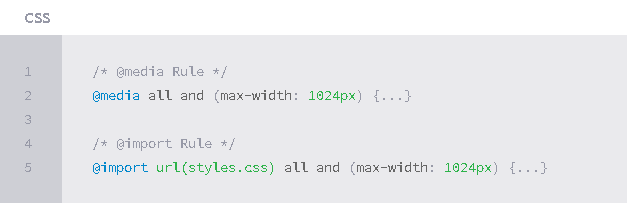
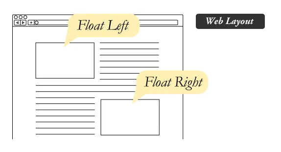
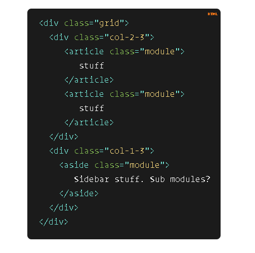

#  <b>Responsive Web Design</b> 

## <b>RWD</b> is practice of building a website suitable to work on every device and every screen size.

### Responsive generally means to react quickly and positively to any change .
###  adaptive means to be easily modified for a new purpose or situation .

#  Responsive web design is broken down into three main components:

|Component:|Defintion|
| ------- |----------------------------------------------------------|
|flexible layouts|the practice of building the layout of a website with a flexible grid, capable of dynamically resizing to any width|
|Media queries| provide the ability to specify different styles for individual browser and device circumstances, the width of the viewport or device orientation for example|
|Flexible Media|As viewports begin to change size media doesn’t always follow suit.Images,videos,and other media types need to be scalable|

## There are a couple different ways to use media queries:
- using the @media rule inside of an existing style sheet.
- by linking to a separate style sheet from within the HTML document.

## Media Features in Media Queries:
- Height & Width Media Features .
- Orientation Media Feature .
- Aspect Ratio Media Features .
- Resolution Media Feature .
- Other media features : include identifying available output colors with use of the color, color-index, and monochrome features .

### Mobile First :One popular technique with using media queries, includes using styles targeted at smaller viewports as the default styles for a website, then use media queries to add styles as the viewport grows.

 

# <b>All About Floats</b>
## Q : What is Float ?
### A : CSS positioning property.

## There are four valid values for the float property:
- Left float .
- Right float .
- none (the default) .
- Inherit : assume the float value from that elements parent element .
  

## Q : What are floats used for?
### A :  create entire web layouts , helpful for layout in smaller instances .
 

### <b>clear</b> use to move itself down past the float . 

# Clear has four valid values:
- Both :  from either direction. 
- Left and Right : clear the float from one direction respectively .
- None : the default .
- Inherit .

# Here Are Examples of Problems with <b>Floats</b> :
- Pushdown .
- Double Margin Bug .

 

#  Don’t Overthink It <b>Grids</b>

## grid context :
- Columns .
- Clearing Context .
- Gutters .
- Sass .
- Modules .

 

#  <b>SMACSS</b> stands to : Scalable and Modular Architecture for Cascading Style Sheet .

## <b>SMACSS</b> is becoming one of the most useful contributions to front-end discussions in years .

