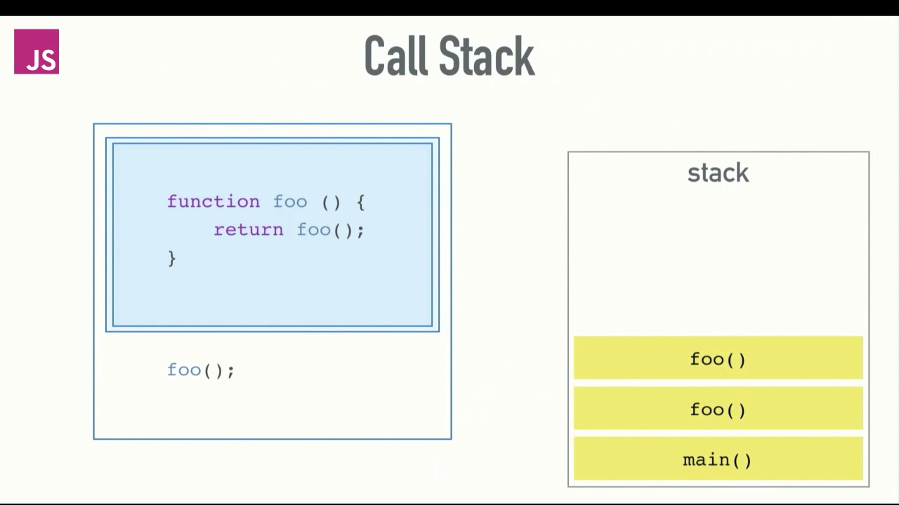
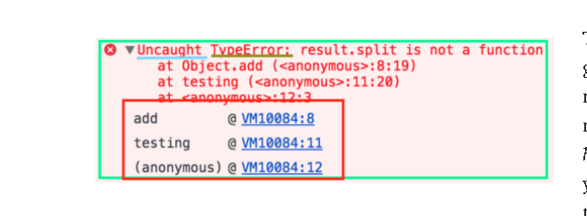

# THE CALL STACK

# A call stack is a mechanism for an interpreter (like the JavaScript interpreter in a web browser) to keep track of its place in a script that calls multiple functions — what function is currently being run and what functions are called from within that function.

## The JavaScript engine (which is found in a hosting environment like the browser), is a single-threaded interpreter comprising of a heap and a single call stack. The browser provides web APIs like the DOM, AJAX, and Timers.

## The call stack is primarily used for function invocation (call).

## What causes a stack overflow?
A stack overflow occurs when there is a recursive function (a function that calls itself) without an exit point. 

# The key takeaways from the call stack are:
1. It is single-threaded. Meaning it can only do one thing at a time.
2. Code execution is synchronous.
3. A function invocation creates a stack frame that occupies a temporary memory.
4. It works as a LIFO — Last In, First Out data structure.

# JavaScript error messages && debugging

# Types of error messages:
- Reference errors:when you try to use a variable that is not yet declared you get this type of errors.
- Syntax errors:when you have something that cannot be parsed in terms of syntax.
- Range errors:when you  manipulate an object with some kind of length and give it an invalid length and this kind of errors will show up.
- Type errors:show up when the types (number, string and so on) you are trying to use or access are incompatible.

