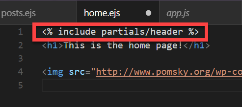

# <b>EJS</b> Partials

## Partials come in handy when you want to reuse the same HTML across multiple views. Think of partials as functions, they make large websites easier to maintain as you don’t have to go and change a piece of text in every page it appears in. Instead, you define that reusable bundle of code in a file andinclude it wherever you need it.

### In EJS, any JavaScript or non-HTML syntax you include in your templates is always surrounded by <% %> delimiters

# Q: What are Observables?
- Observables are similar to promises but with major differences that make them better.
- Observables are a new primitive coming with ES7 (ES2016) that helps handle asynchronous actions and events.

