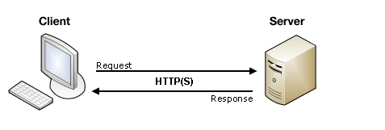

# Sending From Data:

## Client/server architecture:
### At it's most basic, the web uses a client/server architecture that can be summarized as follows :
- a client sends a request to a server using the <b>HTTP protocol</b>
- The server answers the request using the same protocol.
  

## The `<form>` element defines how the data will be sent. All of its attributes are designed to let you configure the request to be sent when a user hits a submit button. 

# The two most important attributes:
1. The `action` attribute : The `action` attribute defines where the data gets sent. Its value must be a valid relative or absolute URL. 
2. The`method`attribute :The `method` attribute defines how data is sent. The <b>HTTP</b> protocol provides several ways to perform a request; HTML form data can be transmitted via a number of different methods,
## the most common being the:
-  `GET` method :the `GET` method is the method used by the browser to ask the server to send back a given resource
-   `POST` method :the method the browser uses to talk to the server when asking for a response that takes into account the data provided in the body of the <b>HTTP</b> request .

   

