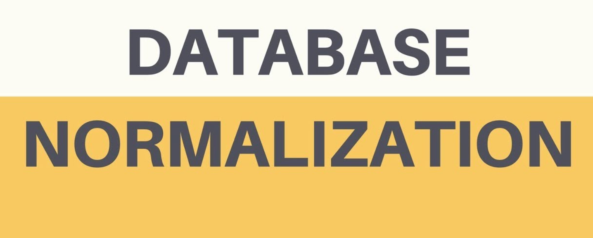

# DATABASE NORMALIZATION

# Q:what is Database normalization ?
 is the process of structuring a database, usually a relational database, in accordance with a series of so-called normal forms in order to reduce data redundancy and improve data integrity.

# When an attempt is made to modify (update, insert into, or delete from) a relation, the following undesirable side-effects may arise in relations that have not been sufficiently normalized:
- Update anomaly. 
- Insertion anomaly.
- Deletion anomaly. 
  
## Normalization is a database design technique, which is used to design a relational database table up to higher normal form.The process is progressive, and a higher level of database normalization cannot be achieved unless the previous levels have been satisfied.

