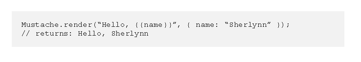
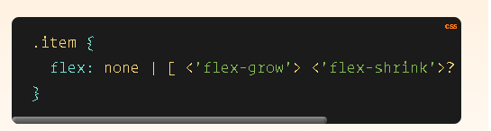

# Javascript Templating Language and Engine— Mustache.js with Node and Express .

## Javascript Templating :is a fast and efficient technique to render client-side view templates with Javascript by using a JSON data source.

##  Mustache : is a logic-less template syntax. It can be used for HTML, config files, source code .

### mustache.js is an implementation of the mustache template system in JavaScript. 

# To install Mustache-Express:
- With Yarn .
-  with NPM .

# Ruby is a programming language whereas Rails is a gem, or a Ruby library.

 

# A Complete Guide to Flexbox

## display : This defines a flex container; inline or block depending on the given value. It enables a flex context for all its direct children.
## flex-grow : This defines the ability for a flex item to grow if necessary.
## flex-direction : This establishes the main-axis, thus defining the direction flex items are placed in the flex container.
## flex-wrap .
## flex-shrink : This defines the ability for a flex item to shrink if necessary.
## flex-basis : This defines the default size of an element before the remaining space is distributed.
## flex-flow : This is a shorthand for the flex-direction and flex-wrap properties.
## justify-content : This defines the alignment along the main axis.

# flex : This is the shorthand for flex-grow, flex-shrink and flex-basis combined. The second and third parameters (flex-shrink and flex-basis) are optional. 

