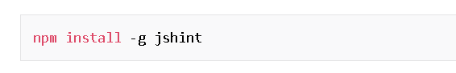

# Node.js

## Node.js is an event-based, non-blocking, asynchronous I/O runtime that uses Google’s V8 JavaScript engine and libuv library.

### Node is built on the V8 engine .

#### Node.js is a program we can use to execute JavaScript on our computers , ( it’s a JavaScript runtime).

### Node.js Has Excellent Support for Modern JavaScript

# to install the jshint package globally on your system use the below command .

## node_modules folder :This is where npm has saved lodash and any libraries that lodash depends on.

#### JavaScript is everywhere, and Node is a vast and expansive subject.

