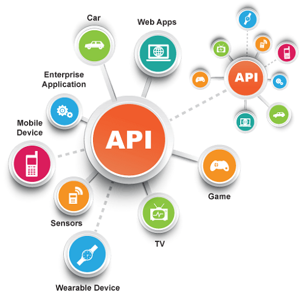
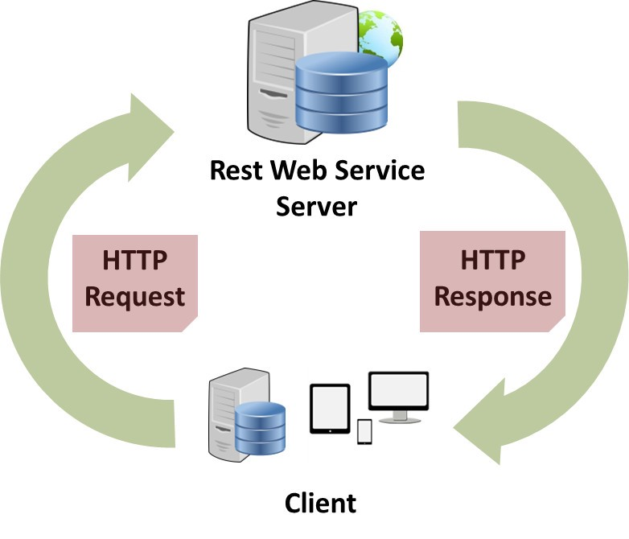

# HTTP: HyperText Transfer Protocol .
## HTTP: is the foundation of data communication for the World Wide Web, where hypertext documents include hyperlinks to other resources that the user can easily access .

# A web page is a “representation” of a resource. Resources are just concepts. 

## URLs tell the browser that there's a concept somewhere. A browser can then go ask for a specific representation of the concept. Specifically, the browser asks for the web page representation of the concept.

# API:

# API : An application programming interface, is a computing interface that defines interactions between multiple software intermediaries. It defines the kinds of calls or requests that can be made, how to make them, the data formats that should be used, the conventions to follow .

# REST:

# REST : Representational state transfer (REST) is a software architectural style that defines a set of constraints to be used for creating Web services.

##  Web services that conform to the REST architectural style, called RESTful Web services, provide interoperability between computer systems on the Internet.

