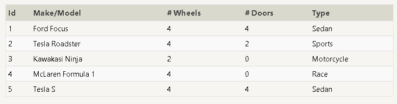

# SQL

# Q: What is SQL?
SQL` Structured Query Language`a language designed to allow both technical and non-technical users query, manipulate, and transform data from a relational database. And due to its simplicity, SQL databases provide safe and scalable storage for millions of websites and mobile applications.

## A relational database represents a collection of related (two-dimensional) tables. Each of the tables are similar to an Excel spreadsheet, with a fixed number of named columns (the attributes or properties of the table) and any number of rows of data.

### <b>SQL</b> keywords are NOT case sensitive: select is the same as SELECT .

#### Semicolon is the standard way to separate each SQL statement in database, systems that allow more than one SQL statement to be executed in the same call to the server.

 
 

##  Important SQL Commands:
- SELECT - extracts data from a database
- UPDATE - updates data in a database
- DELETE - deletes data from a database
- INSERT INTO - inserts new data into a database
- CREATE DATABASE - creates a new database
- ALTER DATABASE - modifies a database
- CREATE TABLE - creates a new table
- ALTER TABLE - modifies a table
- DROP TABLE - deletes a table
- CREATE INDEX - creates an index (search key)
- DROP INDEX - deletes an index
