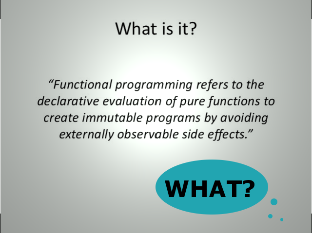

# Concepts of Functional Programming in Javascript

## <b>Complexity</b> is anything that makes software hard to understand or to modify.

## `immutability` and `pure function` are big advantages to build side-effect-free functions, so it is easier to maintain systems.

### Immutability Unchanging over time or unable to be changed.

# Q: What is functional programming?
a programming paradigm — a style of building the structure and elements of computer programs — that treats computation as the evaluation of mathematical functions and avoids changing-state and mutable data.

# Q:how do we know if a function is pure or not?
It returns the same result if given the same arguments (it is also referred as deterministic) It does not cause any observable side effects .

# `pure functions + immutable data = referential transparency`

# Functions as first-class entities can:
- refer to it from constants and variables .
- pass it as a parameter to other functions .
- return it as result from other functions .

# Higher-order functions :a function that either:
- takes one or more functions as arguments, or
- returns a function as its result

# Filter :The filter function expects a true or false value to determine if the element should or should not be included in the result collection.

# Map : transforms a collection by applying a function to all of its elements and building a new collection from the returned values.

# Reduce :to receive a function and a collection, and return a value created by combining the items.