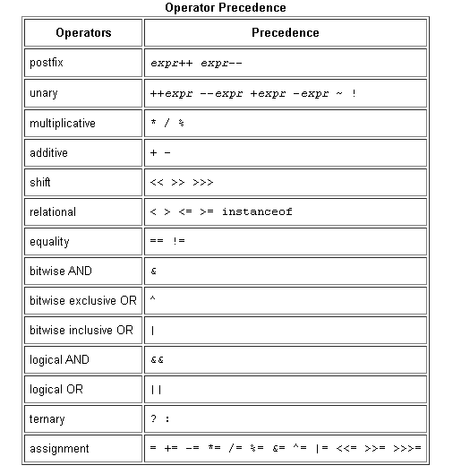

# Java Basics

## <b>Variables</b>
### The Java programming language defines the following kinds of variables:
- Instance Variables:fields declared without the static keyword.
- Class Variables:A class variable is any field declared with the static modifier.
- Local Variables: a method will often store its temporary state in local variables.
- Parameters:parameters are always classified as "variables" not "fields".

## Naming in java :
- Variable names are case-sensitive.
- Subsequent characters may be letters, digits, dollar signs, or underscore characters.
- If the name you choose consists of only one word, spell that word in all lowercase letters else use camelCase.

## <b>Operators</b>

## <b>Expressions, Statements, and Blocks</b>
### <b>An expression </b>
<b>An expression </b> is a construct made up of variables, operators, and method invocations.

### When writing compound expressions, be explicit and indicate with parentheses which operators should be evaluated first. This practice makes code easier to read and to maintain.

### The data type of the value returned by an expression depends on the elements used in the expression.

### <b>Statements</b>
<b>Statements</b> are roughly equivalent to sentences in natural languages. A statement forms a complete unit of execution.

### types of expressions can be made into a statement by terminating the expression with a semicolon (;):
- Assignment expressions
- Any use of ++ or --
- Method invocations
- Object creation expressions

### <b>Blocks</b>
<b>A block</b> is a group of zero or more statements between balanced braces and can be used anywhere a single statement is allowed.

## <b>Control Flow Statements</b>

### break up the flow of execution by employing decision making, looping, and branching, enabling your program to conditionally execute particular blocks of code. 

#### This section describes the decision-making statements:
- (if-then, if-then-else, switch).
- the looping statements (for, while, do-while).
- the branching statements (break, continue, return).

# Q:what is the compiler ?
## A: a compiler is a computer program that translates computer code written in one programming language into another language.