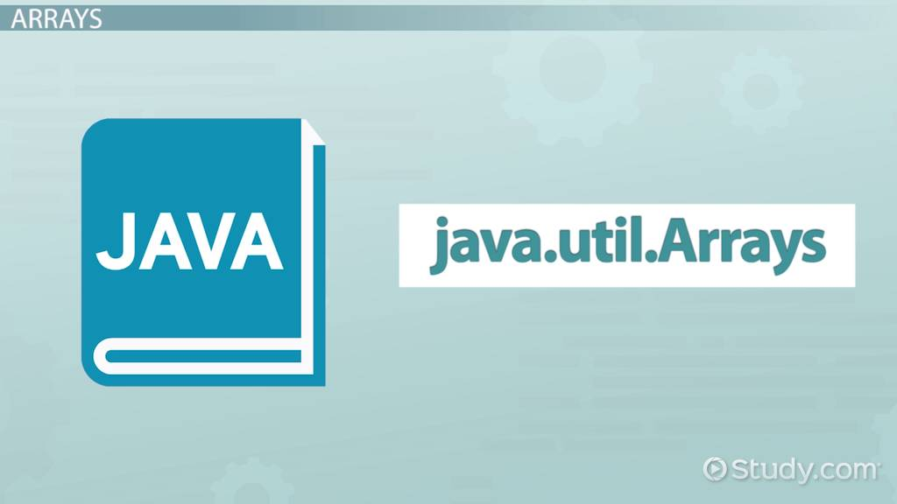
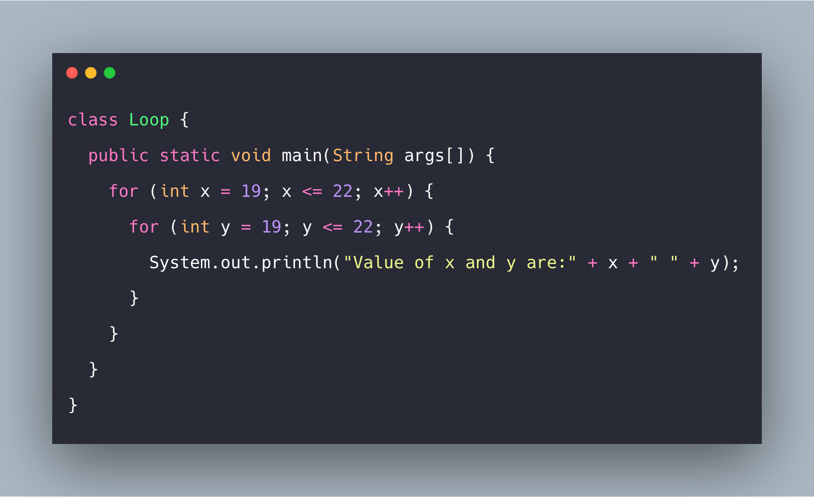

# Arrays, Loops, Imports

# Java Packages and Import:
Java classes can be grouped together in packages. A package name is the same as the directory (folder) name which contains the .java files.

## The order of packages and imports as below:
1. Package statment (optional).
2. Imports (optional).
3. Class or interface definitions.

## when import there are three options which is :
1.  Make all classes visible altho only one is used.
2. Make a single class visible.
3. fully qualified class name without an import.

### facts about NetBeans:
- NetBeans creates packages by default ,default package name similar to  project name.
- NetBeans will create your imports,right click on the source file and choose Fix Imports. It will add all necessary import statements.

#### Static imports in Java 5,that allows static variables without qualifying them with a class name.

# Different types of loops in Java:

## Types of loop:
1. for loop : allows us to repeat certain operations by incrementing and evaluating a loop counter.
2. while loop :t repeats a statement or a block of statements while condition is true.
3. Do-while loop: at least it will run one time.