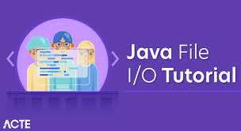
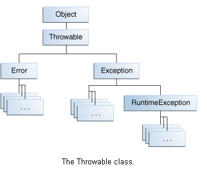

# Maps, primitives, File I/O

## Java Primitives versus Objects

### the primitive types live in the stack while the reference types live in the heap. 
### the primitive types are much faster and require much less memory. 

### Every object contains a single value of the corresponding primitive type. 

# Q:What is autoboxing?
## A:The process of converting a primitive type to a reference one.

# To determine what object is to be used you must consider a bout :
- what application performance we try to achieve.
- how much available memory we have.
- the amount of available memory and what default values we should handle.

## The performance of a Java code it depends on:
- the hardware on which the code runs.
- the compiler that might perform certain optimizations.
- the state of the virtual machine, on the activity of other processes in the operating system.

### Default values of the primitive types are 0 for numeric types, false for the boolean type, \u0000 for the char type. For the wrapper classes, the default value is null.

# Exceptions in Java 

# Q :What Is an Exception?
## A : an event that occurs during the execution of a program that disrupts the normal flow of instructions.

### A program can catch exceptions by using a combination of the try, catch, and finally blocks:
- The try block identifies a block of code in which an exception can occur.
- The catch block identifies a block of code, known as an exception handler, that can handle a particular type of exception.
- The finally block identifies a block of code that is guaranteed to execute, and is the right place to close files, recover resources, and otherwise clean up after the code enclosed in the try block.

### The try statement should contain at least one catch block or a finally block and may have multiple catch blocks

## The Three Kinds of Exceptions:
1. checked exception:subject to the Catch or Specify Requirement. All exceptions are checked exceptions, except for those indicated by Error, RuntimeException, and their subclasses.
2. error exception:are re not subject to the Catch or Specify Requirement. Errors are those exceptions indicated by Error and its subclasses.
3. runtime exception: Runtime exceptions are those indicated by RuntimeException and its subclasses.

# How to Throw Exceptions:

# Using Scanner to read in a file in Java:
## Objects of type Scanner are useful for breaking down formatted input into tokens and translating individual tokens according to their data type.

### Scanner supports tokens for all of the Java language's primitive types (except for char), as well as BigInteger and BigDecimal. Also, numeric values can use thousands separators.
